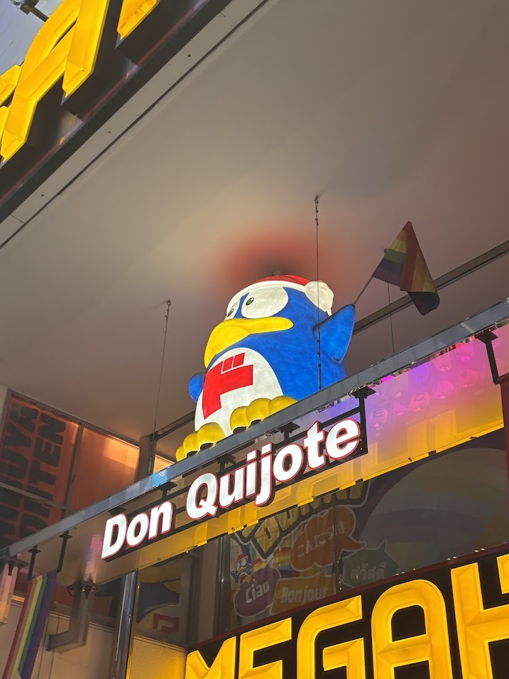
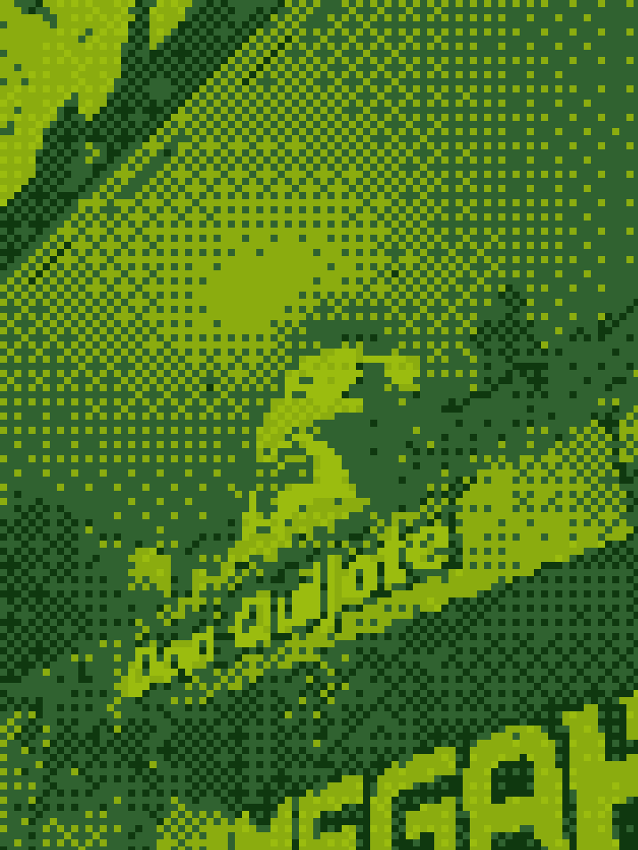
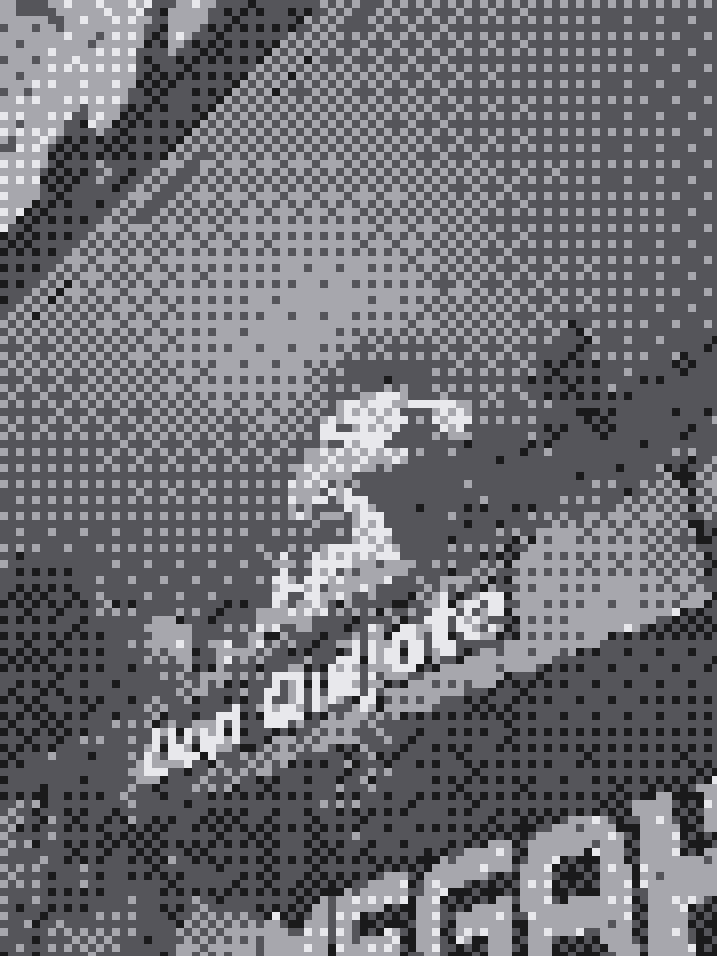
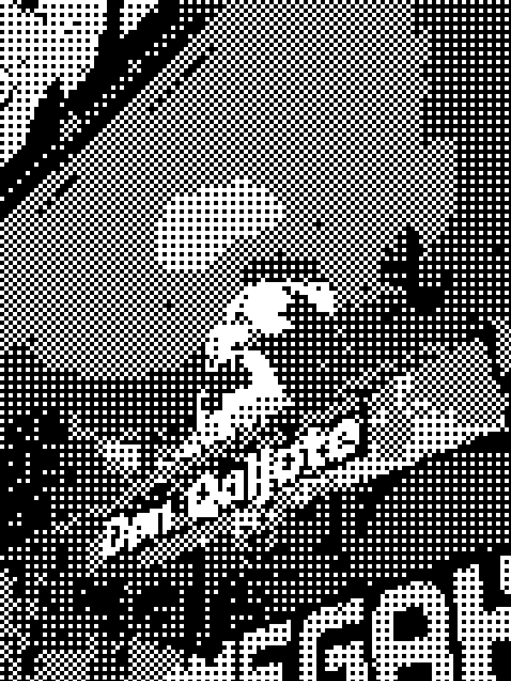
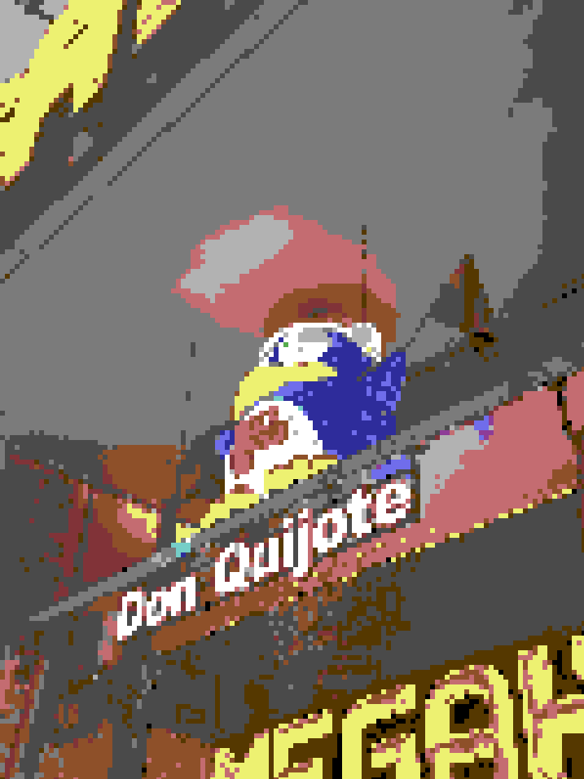
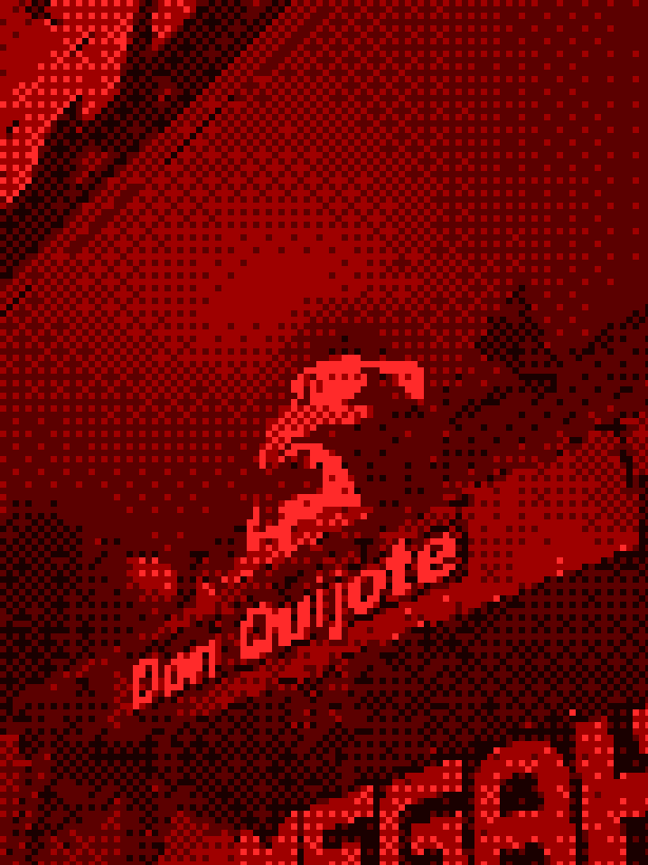
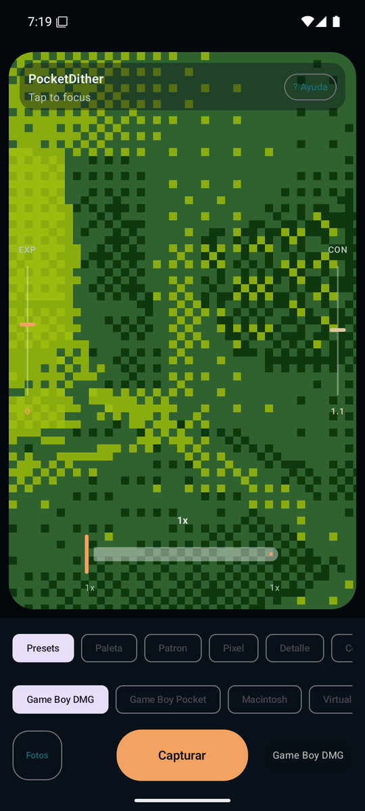

# PocketDither

PocketDither is a native Android camera app that turns live photos into retro dithered images using editable console-inspired presets. It applies color, palette, and pixel-structure effects directly in the camera flow, then saves processed images to the device.

The project explores a small but specific idea: what does a modern phone camera feel like when it is pushed toward handheld retro devices, constrained color systems, and visible digital texture instead of clean realism?

[](https://github.com/marloquemegusta/pocketdither/releases)
[](./LICENSE)
[](https://developer.android.com/)
[](https://kotlinlang.org/)

## Visual Showcase

The examples below use the same ordered-dithering settings and retro palettes exposed by the app presets.

| Original | Game Boy DMG |
| --- | --- |
|  |  |

| Game Boy Pocket | Macintosh | Commodore 64 |
| --- | --- | --- |
|  |  |  |

| Virtual Boy | IBM CGA | Live Camera UI |
| --- | --- | --- |
|  |  |  |

## What It Does

- Shows a processed camera preview in real time
- Captures and saves a processed image with the same visual pipeline used by the preview
- Supports color dithering rather than grayscale-only output
- Includes editable retro presets inspired by Game Boy DMG, Game Boy Pocket, Macintosh, Virtual Boy, IBM CGA, and Commodore 64 graphics
- Exposes controls for palette, pattern, pixel size, detail, contrast, exposure, zoom, flash, and focus
- Saves processed images locally through MediaStore under `Pictures/DitherCamera`

## Installation

Download the latest APK from [GitHub Releases](https://github.com/marloquemegusta/pocketdither/releases).

Release assets may include:

- `PocketDither-debug.apk`: installable debug build
- `PocketDither-release-unsigned.apk`: unsigned release artifact for signing workflows

If a signed release APK is not attached, use the debug APK for manual device testing.

To install manually:

1. Download the APK on your Android device, or transfer it from your computer.
2. Open the APK.
3. Allow installation from that source if Android asks.

Current Android configuration:

- `minSdk` 29
- `targetSdk` 35
- Android 10 or newer is required by the current project settings

## Build From Source

Requirements:

- Android Studio or Android SDK command-line tools
- JDK 17
- Android SDK Platform 35
- Android Build Tools for API 35
- Platform Tools if you want to install with `adb`

Build a debug APK on Windows:

```powershell
$env:JAVA_HOME='C:\Program Files\Android\Android Studio\jbr'
$env:Path="$env:JAVA_HOME\bin;$env:Path"
$env:GRADLE_USER_HOME="$PWD\.gradle"
.\gradlew.bat assembleDebug
```

Output:

```text
app/build/outputs/apk/debug/app-debug.apk
```

Install and launch on a connected device:

```powershell
$adb="$env:LOCALAPPDATA\Android\Sdk\platform-tools\adb.exe"
& $adb install -r .\app\build\outputs\apk\debug\app-debug.apk
& $adb shell am start -n com.marlo.pocketdither/.MainActivity
```

Or use the helper script:

```powershell
.\scripts\install-debug.ps1
```

For release signing, see [docs/release-signing.md](docs/release-signing.md).

## Technical Overview

PocketDither is a native Android project, not a web wrapper.

- Kotlin application code
- Jetpack Compose UI
- CameraX preview, analysis, focus, zoom, flash, exposure, and capture
- CPU-side ordered dithering pipeline
- Palette and preset definitions in Kotlin
- MediaStore export for gallery-visible output
- GitHub Actions for CI builds and tag-triggered release assets

Main implementation areas:

- `app/src/main/java/com/marlo/pocketdither/CameraScreen.kt`: camera UI, CameraX integration, controls, capture flow
- `app/src/main/java/com/marlo/pocketdither/camera/DitherProcessor.kt`: image processing pipeline
- `app/src/main/java/com/marlo/pocketdither/camera/DitherSettings.kt`: presets, palettes, and dither patterns
- `app/src/main/java/com/marlo/pocketdither/camera/BitmapStorage.kt`: MediaStore saving and latest-image lookup

Current architecture is intentionally compact. The main tradeoff is that `CameraScreen.kt` still owns a lot of camera/UI orchestration. A future cleanup would likely move camera-control state and processing settings into clearer state holders.

## AI-Assisted Development Methodology

This project was built with an AI-assisted development workflow. I used AI coding tools as implementation support while retaining ownership over the product concept, UX direction, technical decisions, testing, debugging, evaluation, and release choices.

Android is not my primary stack, and part of the project explores how a technical profile can responsibly build useful open-source tools outside their core implementation area with AI-assisted coding. The goal is not to present AI as an autopilot, but to show a practical workflow where AI accelerates implementation while human judgment remains responsible for scope, taste, validation, and quality.

## Known Limitations

PocketDither is a functional portfolio/open-source project, but it is not presented as production-grade camera software.

- Camera behavior varies across Android devices.
- Rotation and app resume can still desync zoom, contrast, or exposure on some phones.
- Preview and capture are designed to look close, but are not guaranteed to be mathematically identical on every device path.
- Release artifacts may include unsigned APKs unless signing is configured.
- Earlier local/test builds used a previous package id, so installing current builds may require uninstalling older test versions first.

More detail is tracked in [docs/known-issues.md](docs/known-issues.md).

## Roadmap

Near-term:

- replace emulator UI screenshots with curated real-device captures
- improve preview/capture parity
- harden lifecycle, rotation, and device-specific camera behavior
- refine the UI for different aspect ratios and foldables

Future ideas:

- add more dithering algorithms
- expand the preset library
- add before/after comparison views
- improve export/gallery flow
- add signed release publishing

Non-goals for now:

- cloud processing
- social features
- full photo-editor workflows
- claims of device-wide production readiness

## Contributing

Contributions are welcome, especially around:

- Android device compatibility
- CameraX edge cases
- image-processing performance
- new palettes and presets
- UI polish
- preview/capture fidelity

For larger changes, open an issue first so the scope stays aligned with the project.

## Repository Notes

- License: [MIT](LICENSE)
- Release signing: [docs/release-signing.md](docs/release-signing.md)
- Known issues: [docs/known-issues.md](docs/known-issues.md)
- Local Android files such as `local.properties` and signing keys are ignored by Git

## Acknowledgements

PocketDither is built and maintained by Marlo, with AI-assisted implementation support from OpenAI Codex. It uses Android, Kotlin, Jetpack Compose, CameraX, and MediaStore.
